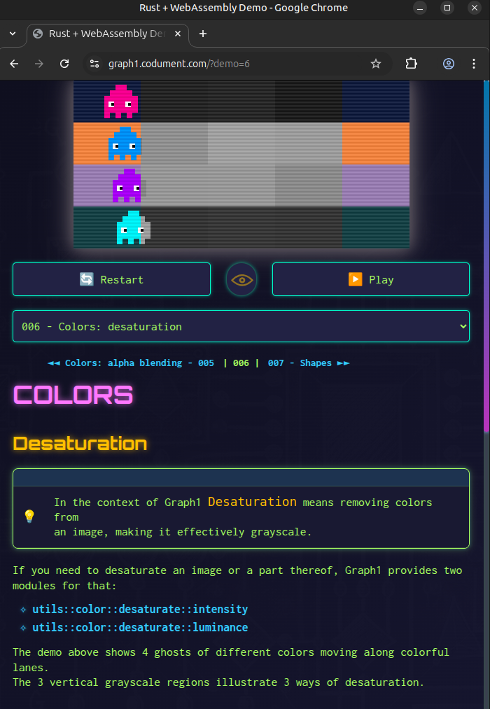

# Graph1 WASM Demos

This repository contains a collection of demos showcasing the capabilities of **Graph1**, a Rust library for creating 2D-graphics and animations in Rust.

- Includes the full source code for [https://graph1.codument.com](https://graph1.codument.com).
- The Graph1 library can be found at [https://github.com/dipdowel/graph1](https://github.com/dipdowel/graph1).
- - - - - - - - 

## Grid Resolution Table

| Square Side | Horizontal Squares | Vertical Squares | Resolution     |
|-------------|--------------------|------------------|----------------|
| 1           | 480                | 240              | 480 × 240      |
| 2           | 240                | 120              | 240 × 120      |
| 3           | 160                | 80               | 160 × 80       |
| 4           | 120                | 60               | 120 × 60       |
| 5           | 96                 | 48               | 96 × 48        |
| 6           | 80                 | 40               | 80 × 40        |
| 8           | 60                 | 30               | 60 × 30        |
| 10          | 48                 | 24               | 48 × 24        |
| 12          | 40                 | 20               | 40 × 20        |
| 15          | 32                 | 16               | 32 × 16        |
| 16          | 30                 | 15               | 30 × 15        |
| 20          | 24                 | 12               | 24 × 12        |
| 24          | 20                 | 10               | 20 × 10        |
| 30          | 16                 | 8                | 16 × 8         |
| 40          | 12                 | 6                | 12 × 6         |
| 48          | 10                 | 5                | 10 × 5         |
| 60          | 8                  | 4                | 8 × 4          |
| 80          | 6                  | 3                | 6 × 3          |
| 120         | 4                  | 2                | 4 × 2          |
| 240         | 2                  | 1                | 2 × 1          |
